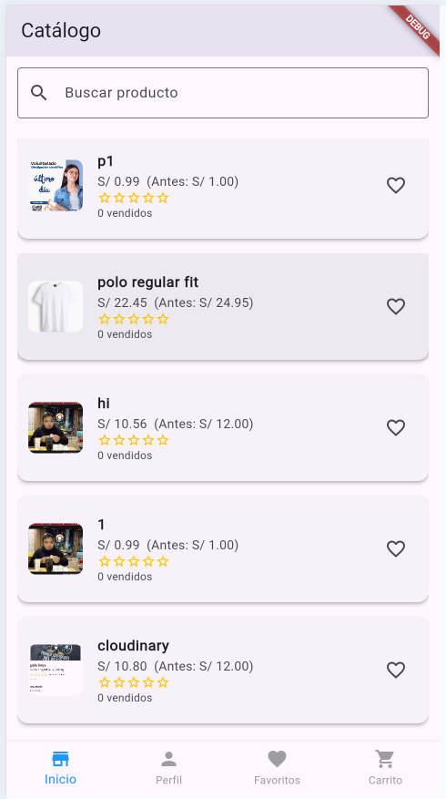
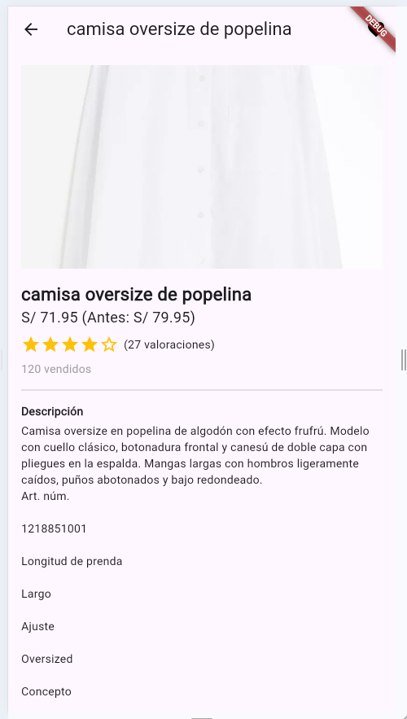
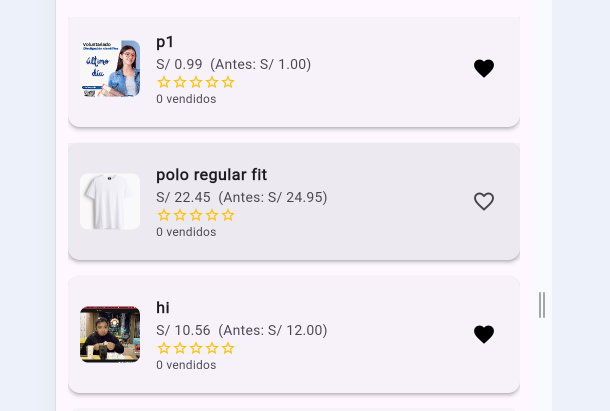
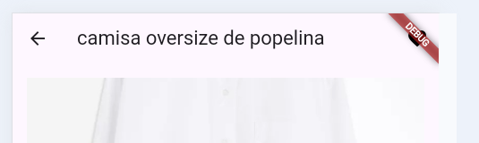
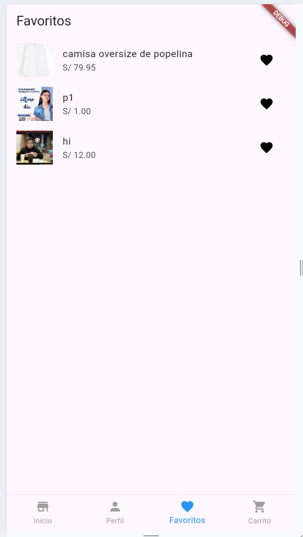

# SM2_EXAMEN_PRACTICO

**Curso:** Soluciones Móviles II  
**Docente:** Dr. Oscar Juan Jimenez Flores  

**Alumno:**
- Mayner Gonzalo Anahua Coaquira – 2020067145  

Esta aplicación móvil se presenta una tienda de ropa desarrollada con **Flutter** y conectada a **Firebase (Firestore)** para gestión de datos, y **Cloudinary** para el almacenamiento de imágenes. La app permite a los usuarios:

- Navegar por un catálogo de productos.
- Marcar productos como favoritos para revisarlos más tarde.

> **Nota:** La funcionalidad de inicio de sesión está incluida, pero no se detalla en esta entrega ya que se considera por defecto.

---

## Funcionalidades Implementadas

### 1. Visualización del Catálogo de Productos

Los usuarios pueden ver una lista de productos disponibles con su imagen, nombre, precio, cantidad de vendidos y calificación. Ademas de opciones de añadir a Favoritos o al Carrito de compras. Esta vista está disponible en el apartado de **Inicio** de la aplicación.

**Imagen de esta funcionalidad:**

Vista del catalogo con los diferentes productos

El detalle de cada producto, el cual tambien se complementa con la historia de usuario sobre "Agregar a favoritos"

### 2. Agregar productos a favoritos

Los usuarios pueden marcar productos como favoritos. Estos se almacenan en Firebase y se pueden consultar luego en la pestaña de **Favoritos**.

**Imagen de esta funcionalidad:**  
Aqui vemos la lista de productos con la opcion de Favoritos "Marcada"

En la parte superior del detalle tambien se encuentra marcado el simbolo de favoritos

Finalmente "Favoritos" tiene un apartado en el menu de navegacion inferior donde podremos ver todos los porducto marcados como "Favoritos"

---

## Historias de Usuario

| ID  | Título                        | Historia                                                                          | Criterios de Aceptación                                        |
| --- | ----------------------------- | --------------------------------------------------------------------------------- | -------------------------------------------------------------- |
| 3   | Visualización de Catálogos    | Como cliente, quiero explorar un catálogo con imágenes, precios y calificaciones. | CA01: Visualización CA02: Ordenar por calificación o precio |
| 12  | Agregar productos a favoritos | Como cliente, quiero agregar productos a una lista de deseos.                     | CA01: Agregar a favoritos CA02: Visualización de favoritos  |

---

## Tecnologías y Herramientas Usadas

- [Flutter](https://flutter.dev/)
- [Firebase Firestore](https://firebase.google.com/products/firestore)
- [Firebase Authentication](https://firebase.google.com/products/auth)
- [Cloudinary](https://cloudinary.com/) - Para almacenamiento de imágenes

---

## Enlace al Repositorio

[🔗 Repositorio público en GitHub](https://github.com/MAYnerAC/SM2_EXAMEN_PRACTICO)

---

## Créditos y Referencias

- Documentación oficial de [Flutter](https://docs.flutter.dev/)
- Guía de integración de [Firebase con Flutter](https://firebase.flutter.dev/)
- Uso de [Cloudinary en Flutter](https://cloudinary.com/documentation/flutter_integration)

---

